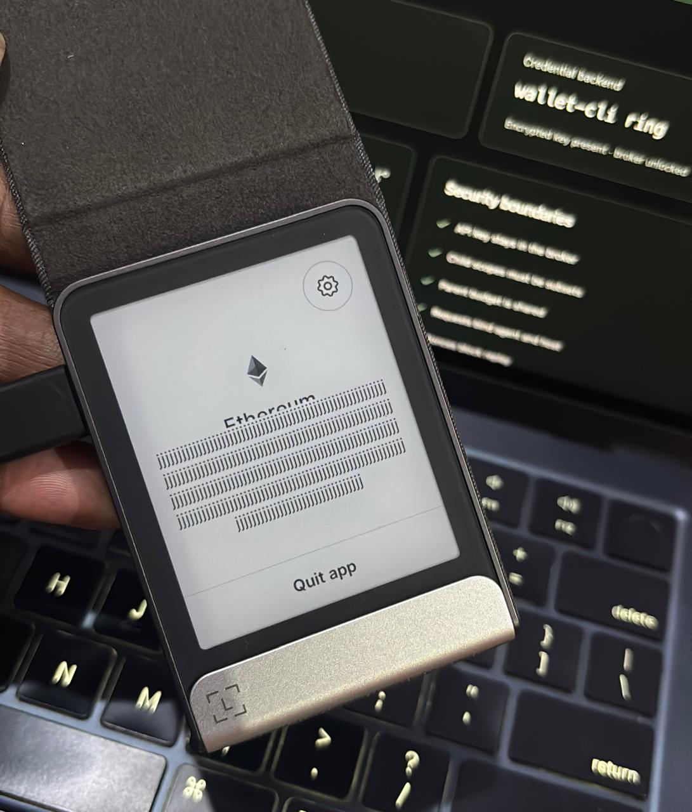

# Ledger Agent Stack developer feedback

RingTree uses Ledger Flex, DMK/WebHID, the Ethereum signer kit, and the official `wallet-cli ring` CLI. The trusted broker and Key Ring remain on the owner's computer, while credential-free agents run on a remote VPS with signed, scoped capabilities.

## What worked well

- DMK cleanly separates device discovery and session management from Ethereum signing.
- `signMessage` supports readable, versioned approvals containing scope, expiry, nonce, and broker identity.
- `wallet-cli ring encrypt/decrypt` provides a small, scriptable boundary for API and payment credentials.
- Named Key Ring entries make it practical to isolate the OpenAI, The Graph, and agent-payment secrets.

## Ledger Flex became stuck during testing

During physical-device testing, Ledger Flex became stuck while the Ethereum app was open. The screen displayed repeated, garbled characters and the device appeared unresponsive in this state. I do not know whether the cause was the device firmware, Ethereum app, USB/WebHID transport, or DMK, so I raised a request with official Ledger Support for investigation.

A documented diagnostic and recovery flow for unexpected device-app states would help. It should explain which firmware, app, transport, and DMK version details to collect; which logs are safe to share; and when to disconnect, quit the app, or restart the device.

## Remote-agent guidance

The public flow is clear for a USB-connected local machine, but a secure architecture for agents on a VPS or CI host requires more design work. An official end-to-end reference showing how to keep credentials local, expose only scoped capabilities, and handle Key Ring membership, revocation, and rotation would help teams avoid treating broad decryption access as agent authorization.

## Password handling and diagnostics

For non-interactive use, `wallet-cli ring` reads its password from `WALLET_PASS`. RingTree limits that exposure to short-lived CLI child processes and removes the value from the long-running broker environment. Native OS-keychain references would reduce this remaining process-environment exposure.

A Ring-specific diagnostic command could safely check profile configuration, OS-keychain access, password acceptance, network reachability, and Key Ring backend status without printing plaintext or credentials.

## Compatibility and device-display guarantees

DMK, signer kits, context modules, device firmware, Ethereum app versions, and `wallet-cli` can evolve independently. A tested compatibility matrix with known-good combinations and breaking changes would make integration and incident diagnosis easier.

Software can detect some fallback states but cannot prove what the user saw on the physical device. The documentation should clearly separate what DMK can assert from what the user must visually verify, including recommended fail-closed behavior for blind-signing or hash-only displays.
