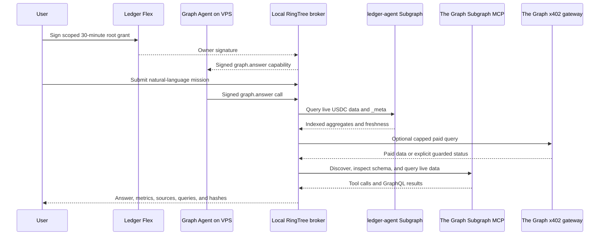

# The Graph integration

RingTree uses The Graph as a load-bearing data layer for its Graph Agent. The agent combines a first-party Base Sepolia USDC Subgraph, the official Subgraph MCP, and a guarded x402 pay-per-query path. It does not answer from mocked, local-only, or static blockchain data.

## ETHOnline 2026 track

- Sponsor: The Graph
- Prize: Best AI Tooling or AI Use Case with The Graph
- Pool: Start Fresh
- Repository: https://github.com/akashbiswas0/Ringtree
- Demo: https://youtu.be/NsyvSZPb6x4

RingTree was started during ETHOnline 2026. The repository's first commit is dated September 6, 2026, after the event began on September 4, 2026.

## Why The Graph is load-bearing

A Graph mission cannot complete unless RingTree obtains valid live data. The broker:

1. Queries the deployed `ledger-agent` Subgraph.
2. Rejects data with indexing errors, missing aggregates, or stale block timestamps.
3. Optionally performs a budgeted x402 query against an allocated testnet Subgraph.
4. Gives the model access to the official Subgraph MCP for discovery, schema inspection, and live GraphQL execution.
5. Verifies that the MCP call sequence included discovery, a 30-day activity check, schema inspection, and a live query.
6. Returns the answer with source identifiers, query text, output hashes, byte counts, freshness, and explicit limitations.

If the live Graph sequence is incomplete, RingTree rejects the answer instead of returning unsupported model text.

## 1. First-party `ledger-agent` Subgraph

This Subgraph indexes Circle USDC activity on Base Sepolia.

| Field | Value |
| --- | --- |
| Subgraph name | `ledger-agent` |
| Graph provider | Subgraph Studio |
| Studio query ID | `95022` |
| Version | `v0.0.3` |
| Query endpoint | `https://api.studio.thegraph.com/query/95022/ledger-agent/v0.0.3` |
| Network | `base-sepolia` |
| Data source | Circle USDC |
| USDC contract | `0x036CbD53842c5426634e7929541eC2318f3dCF7e` |
| Start block | `46600000` |

The custom Studio deployment is queried through its development endpoint. A published Graph Network Subgraph ID or immutable deployment/IPFS hash for `ledger-agent` is not hard-coded in this repository, so this document does not claim one.

### Indexed entities

- `Transfer`: immutable transfer amount, sender, recipient, block, timestamp, and transaction hash.
- `Account`: cumulative sent and received amounts, transfer count, and latest activity.
- `USDCActivity`: global transfer count, volume, and latest indexed block and timestamp.
- `USDCActivityHour`: hourly volume, transfer count, maximum transfer, and large/whale activity.
- `USDCActivityDay`: daily volume, transfer count, maximum transfer, and large/whale activity.

The mapping classifies transfers of at least `10,000 USDC` as large and transfers of at least `100,000 USDC` as whale transfers.

### Deterministic analysis

The broker calculates matching latest and previous 24-hour windows from the hourly entities without floating-point arithmetic. It reports:

- 24-hour USDC volume
- Transfer count
- Large-transfer count
- Whale-transfer count and volume
- Maximum transfer
- Volume change
- Transfer-count change

Before using the data, the broker checks `_meta.hasIndexingErrors`, the indexed block, required aggregates, and block freshness. Data more than 15 minutes behind is rejected as syncing.

## 2. Official Subgraph MCP

RingTree connects the model to The Graph's official read-only Subgraph MCP:

`https://subgraphs.mcp.thegraph.com/sse`

The Graph Gateway API key is encrypted locally with `wallet-cli ring`. It is supplied only by the trusted local broker for the MCP request; the remote VPS agents never receive it.

### Allowed MCP operations

RingTree allowlists only the operations required for evidence-backed research:

- `search_subgraphs_by_keyword`
- `get_top_subgraph_deployments`
- `get_deployment_30day_query_counts`
- `get_schema_by_deployment_id`
- `get_schema_by_subgraph_id`
- `get_schema_by_ipfs_hash`
- `execute_query_by_deployment_id`
- `execute_query_by_subgraph_id`

### Enforced research sequence

For each answer, the Graph Agent must:

1. Discover candidate Subgraphs by keyword or verified contract address.
2. Check candidate deployment activity over the previous 30 days.
3. Inspect the selected schema using the matching identifier type.
4. Execute a live `_meta` query.
5. Execute a focused, schema-specific GraphQL query.

The broker records each MCP operation's identifier, query, argument hash, output hash, and output size. For multi-protocol questions, it reports when two distinct comparable sources or a standardized schema could not be verified.

## 3. x402 Graph queries

RingTree also implements agent-paid access to an allocated Subgraph through The Graph's Base Sepolia x402 gateway.

This is separate from the first-party `ledger-agent` Studio deployment.

| Field | Value |
| --- | --- |
| Subgraph purpose | Shinkai identity and delegation data |
| Subgraph ID | `69kQZiehpuHGMjYwzV5qZQUn75nZRH1ewn5nM4WzoZEv` |
| Endpoint | `https://gateway.testnet.thegraph.com/api/x402/subgraphs/id/69kQZiehpuHGMjYwzV5qZQUn75nZRH1ewn5nM4WzoZEv` |
| Payment network | Base Sepolia (`eip155:84532`) |
| Payment asset | Circle Base Sepolia USDC |
| USDC contract | `0x036CbD53842c5426634e7929541eC2318f3dCF7e` |
| Maximum per payment | `0.02 USDC` |
| Daily limit | `0.10 USDC` per UTC day |
| Receipt policy | At most one durable receipt per mission |

The x402 client validates the payment requirement before signing. It accepts only the exact scheme, Base Sepolia, the fixed USDC asset, a positive amount within the configured cap, and a valid recipient.

After payment, RingTree validates the settlement success flag, network, payer, amount, transaction hash, indexing status, result shape, and block freshness. Duplicate mission payments are blocked, daily budget is reserved atomically, and failures open a ten-minute circuit breaker for the same Subgraph.

The payment wallet is separate from the Ledger owner account. Its private key is encrypted with the named Key Ring key `ringtree-agent-payment` and is decrypted only inside the local broker for the bounded x402 operation.

## End-to-end mission flow



## Example Graph Agent questions

- `Summarize live Base USDC activity from the last 24 hours.`
- `Show recent Base USDC whale-transfer activity.`
- `Compare the latest and previous 24-hour USDC volume.`
- `Compare Aave and Morpho lending activity on Base.`

Cross-protocol comparisons depend on two accessible live sources with comparable fields. When that evidence is unavailable, RingTree returns the verified partial result and names the limitation rather than inventing a comparison.

## Verify the live Studio Subgraph

```sh
curl -X POST \
  https://api.studio.thegraph.com/query/95022/ledger-agent/v0.0.3 \
  -H 'Content-Type: application/json' \
  --data '{"query":"{ _meta { block { number timestamp } hasIndexingErrors } usdcactivity(id: \"global\") { totalTransferCount totalVolume lastBlock lastTimestamp } }"}'
```

A healthy response contains live `_meta` block data, `hasIndexingErrors: false`, and the global USDC activity aggregate.

## Build and test

```sh
npm ci
npm run graph:codegen
npm run graph:build
npm run graph:test
npm test
```

Automated coverage includes Subgraph mapping behavior, deterministic 24-hour calculations, MCP sequence enforcement, missing-evidence rejection, multi-source comparison warnings, x402 requirement and settlement validation, duplicate protection, daily budgets, and circuit breaking.

## Code map

| Path | Responsibility |
| --- | --- |
| [`subgraph/subgraph.yaml`](subgraph/subgraph.yaml) | Base Sepolia USDC data source and start block |
| [`subgraph/schema.graphql`](subgraph/schema.graphql) | Transfer, account, global, hourly, and daily entities |
| [`subgraph/src/usdc.ts`](subgraph/src/usdc.ts) | Transfer indexing and aggregate updates |
| [`server/graph-agent.ts`](server/graph-agent.ts) | Studio queries, deterministic windows, MCP workflow, and evidence enforcement |
| [`server/x402.ts`](server/x402.ts) | Paid Graph query, spend controls, settlement validation, and receipts |
| [`server/secrets.ts`](server/secrets.ts) | Key Ring-protected Graph and payment credentials |
| [`scripts/agent.ts`](scripts/agent.ts) | Remote Graph Agent mission execution |
| [`src/App.tsx`](src/App.tsx) | Mission UI, Graph metrics, sources, query evidence, and x402 status |
| [`tests/graph-agent.test.ts`](tests/graph-agent.test.ts) | Live-query sequence and evidence tests |
| [`tests/x402.test.ts`](tests/x402.test.ts) | x402 payment and budget tests |
| [`subgraph/tests/usdc.test.ts`](subgraph/tests/usdc.test.ts) | Mapping tests |
