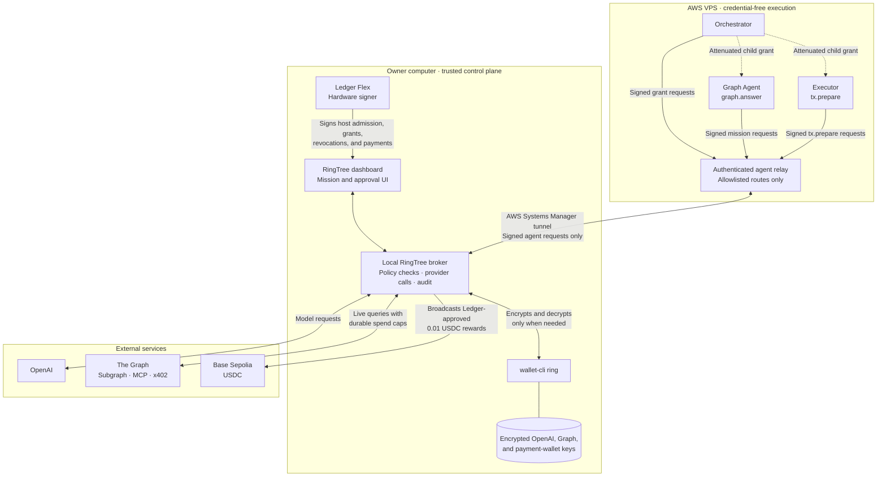

RingTree Demo Video: [https://youtu.be/NsyvSZPb6x4](https://youtu.be/NsyvSZPb6x4)

# RingTree

Open-source under the [MIT License](LICENSE), copyright 2026 RingTree.

RingTree is a single-owner, Ledger-rooted control plane for agents running on an AWS VPS. The trusted broker stays on the owner's computer, where the official `wallet-cli ring` encrypts and decrypts the OpenAI key, The Graph key, and the Graph Agent payment key. AWS agents receive signed, scoped capabilities, not credentials.

## What is implemented

- Ledger Flex address verification and signing through Ledger DMK/WebHID.
- Readable approvals for host admission, scoped 30-minute grants, revocation, and payments.
- Three isolated VPS identities: orchestrator, Graph Agent, and executor.
- Expiry, replay protection, shared quotas, attenuated delegation, and cascading revocation.
- Live Subgraph and Subgraph MCP research with guarded x402 access.
- A fixed `0.01 USDC` reward proposed only after a successful mission and signed separately on Ledger.
- Persistent SQLite mission history and a hash-linked audit log.

## Architecture



The relay cannot access owner routes, provider credentials, the Key Ring password, broker storage, or Ledger signing. The local broker performs every policy check and provider call. The computer must remain online while the AWS agents work.

## Judge setup: test Ledger locally

This flow uses the judge's own Ledger and a disposable local agent identity. It does not connect to RingTree's production VPS.

Requirements: Node.js 22.13+, Chrome or Edge, and a Ledger Flex with the Ethereum app.

```sh
git clone https://github.com/akashbiswas0/Ringtree.git
cd Ringtree
npm ci
npm run build
npm run setup
npm run broker
```

During `npm run setup`, enter an Ethereum address verified on the Ledger. Keep the broker running, then use a second terminal:

```sh
npm run agent -- init
```

Open `http://localhost:4318/workspace`. Connect Ledger Flex, approve the local test host, sign a 30-minute root grant, and test revocation. These steps verify DMK/WebHID connection, on-device address verification, readable permission signing, and the capability lifecycle.

This local flow does not create a Graph mission or transaction proposal. RingTree does not accept arbitrary transactions: the `0.01 USDC` reward exists only after the private VPS Graph Agent completes a mission. Transaction signing is demonstrated in the video.

Judges with an existing Ledger Key Ring can additionally run `npm run setup -- check` to perform a non-sensitive encrypt/decrypt probe. Do not reinitialize an existing ring.

## Private live VPS

The production orchestrator, Graph Agent, executor, and relay remain live on the owner's VPS. The VPS has no public inbound application port; access requires the owner's AWS Systems Manager permissions and private relay token. Judges cannot and do not need to connect a local clone to these agents. The complete private-VPS mission and Ledger-approved transaction flow is shown in the demo video.

Owner-only deployment and tunnel scripts are included under `scripts/aws.ts` and `deploy/` for code review.

## Graph integration

The deployed `ledger-agent` Subgraph, official Subgraph MCP workflow, x402 Subgraph ID, endpoints, limits, verification steps, and code map are documented in [`GRAPH.md`](GRAPH.md).

## Security boundaries

- VPS agents receive signed capabilities, never provider credentials, the Key Ring password, or Ledger signing access.
- Agents cannot choose a URL, MCP server, model, secret name, payment recipient, token, network, amount, or arbitrary RPC call.
- Only `graph.answer` and `tx.prepare` are grantable tools.
- x402 is fixed to The Graph testnet gateway and capped at `0.02 USDC` per payment and `0.10 USDC` per UTC day.
- The reward is fixed at `0.01 USDC` to the configured Graph Agent payment address.
- A compromised local broker OS or `wallet-cli` breaks the trusted boundary. This is not a TEE or multi-tenant vault.
- Software cannot prove what the physical Ledger screen displayed. Reject blind-signing or hash-only screens.

## Repository map

| Path | Responsibility |
| --- | --- |
| `shared/protocol.ts` | Signed capability schemas |
| `server/authority.ts` | Scope, quota, expiry, replay, and revocation enforcement |
| `server/secrets.ts` | Official `wallet-cli ring` boundary |
| `server/graph-agent.ts` | Live Graph MCP workflow and evidence checks |
| `server/x402.ts` | Fixed, capped x402 Graph query |
| `server/agent-relay.ts` | Credential-free AWS/local bridge |
| `scripts/agent.ts` | Orchestrator, Graph Agent, and executor runtimes |
| `subgraph/` | Base Sepolia USDC Subgraph |
| `src/ledger.ts` | Ledger DMK session and signing |

See [`GRAPH.md`](GRAPH.md) for The Graph details and [`FEEDBACK.md`](FEEDBACK.md) for Ledger integration feedback.

## Verification

```sh
npm run build
npm test
npm audit
npm run graph:build
npm run graph:test
```

Automated tests use disposable software wallets only inside `tests/`. They do not replace physical-device and live-service verification.
