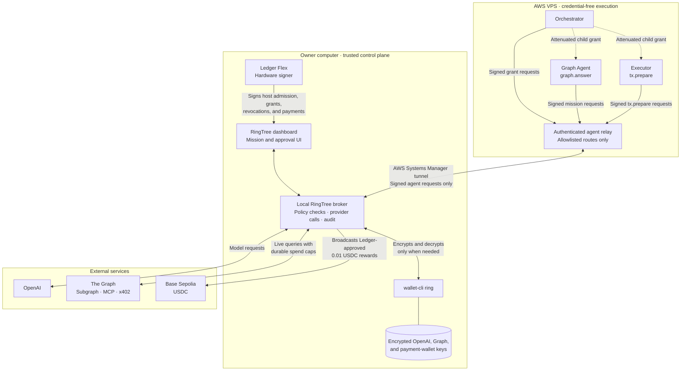

# RingTree

Open-source under the [MIT License](LICENSE), copyright 2026 RingTree.

RingTree is a single-owner, Ledger-rooted control plane for agents running on an AWS VPS. The trusted broker stays on the owner's computer, where the official `wallet-cli ring` encrypts and decrypts the OpenAI key, The Graph key, and the Graph Agent payment key. AWS agents receive signed, scoped capabilities, not credentials.

## What is implemented

- Ledger Flex address verification and signing through Ledger DMK/WebHID.
- Readable owner approvals for host admission, 30-minute root grants, revocation, and transaction decisions.
- Three isolated AWS identities: orchestrator, Graph Agent, and executor.
- Attenuating child grants, host and agent signatures, expiry, replay protection, shared ancestor quotas, and cascading revocation.
- A credential-free AWS relay reachable only through an authenticated SSM tunnel.
- A minimal AWS agent-state response that omits owner UI, payment payloads, provider details, and audit history.
- A Graph Agent using `gpt-5.6-terra`, the live RingTree Base Sepolia USDC Subgraph, and The Graph Subgraph MCP.
- A separate Key Ring-protected payment wallet that pays for real identity/delegation data from an allocated Graph testnet Subgraph through x402.
- Deterministic 24-hour USDC windows plus durable per-query, per-mission, and daily Graph spend controls.
- One mission-linked `0.01 USDC` reward proposed only after a successful Graph mission and signed separately on Ledger.
- Persistent SQLite mission history and a hash-linked audit log.

## Architecture



The relay cannot access owner routes, provider credentials, the Key Ring password, broker storage, or Ledger signing. The local broker performs every policy check and provider call. The computer must remain online while the AWS agents work.

## Local setup

Requirements: Node.js 22.13+, `wallet-cli` 2.1.0, Chrome or Edge, and a Ledger Flex with the Ethereum and Ledger Sync apps.

```sh
npm ci
npm run setup
npm run setup -- secret
npm run setup -- graph-secret
npm run setup -- payment-wallet
RINGTREE_PORT=4321 npm run setup -- serve
```

Use the existing Key Ring password; do not reinitialize a working ring. Setup reads secrets through hidden terminal prompts, verifies a public encrypt/decrypt probe before listening, and refuses to overwrite existing ciphertext. The password is held only in broker process memory, rather than its long-lived environment. It is passed only to short-lived `wallet-cli` subprocesses as required by the CLI.

The dashboard is served by the broker at `http://localhost:4321`. Connect Flex, authorize the registered agent host, and sign a 30-minute root grant. Submit missions from the **Graph Agent** tab. A reward appears in **Approvals** only after a mission completes.

## AWS agents

The current VPS uses no inbound security-group rules. AWS Systems Manager carries the tunnel.

```sh
npm run aws -- deploy-relay
npm run aws -- result COMMAND_ID
npm run aws -- relay-tunnel
```

In a second terminal:

```sh
npm run connect:aws
```

The connector defaults to local broker port `4321`. Override it with `RINGTREE_LOCAL_BROKER_URL` if needed.

## Graph integration

The first-party `ledger-agent` Subgraph indexes Circle Base Sepolia USDC transfers from block `46600000`, account totals, hourly/day snapshots, large transfers, whale activity, and global activity. The agent also discovers Subgraphs through The Graph MCP, checks activity, inspects schemas, and executes live queries before returning an answer. It records exact query and identifier hashes, normalizes six-decimal USDC, and explicitly reports when a two-protocol comparison lacks two accessible live sources.

## Security boundaries

- Agents cannot choose a URL, MCP server, model, secret name, payment recipient, token, network, amount, or arbitrary RPC call.
- AWS agents receive only grants, mission scheduling state, and proposal status; they cannot read the dashboard state or audit log.
- Only `graph.answer` and `tx.prepare` are grantable tools.
- x402 is fixed to The Graph testnet gateway, Base Sepolia USDC, and a maximum of `0.02 USDC` per payment.
- x402 is limited to one durable receipt per mission and `0.10 USDC` per UTC day.
- The fixed reward is `0.01 USDC` to the configured Graph Agent payment address.
- Provider credentials exist briefly in local broker process memory; Node.js strings cannot be reliably zeroized.
- The Key Ring password briefly appears in each `wallet-cli` child environment because that is the CLI's documented non-interactive interface; it is absent from the long-running broker environment and from every AWS process.
- A compromised local broker OS or `wallet-cli` breaks the trusted boundary. This is not a TEE or multi-tenant vault.
- Software cannot prove what the physical Ledger screen displayed. Reject blind-signing or hash-only screens.

## Repository map

| Path | Responsibility |
| --- | --- |
| `shared/protocol.ts` | Signed capability schemas |
| `server/authority.ts` | Scope, quota, expiry, replay, and revocation enforcement |
| `server/secrets.ts` | Official `wallet-cli ring` boundary |
| `server/graph-agent.ts` | Live Graph MCP workflow and evidence checks |
| `server/x402.ts` | Fixed, capped x402 Graph query |
| `server/agent-relay.ts` | Credential-free AWS/local bridge |
| `scripts/agent.ts` | Orchestrator, Graph Agent, and executor runtimes |
| `subgraph/` | Base Sepolia USDC Subgraph |
| `src/ledger.ts` | Ledger DMK session and signing |

## Verification

```sh
npm run build
npm test
npm audit
npm run graph:build
npm run graph:test
```

Automated tests use disposable software wallets only inside `tests/`. They do not replace physical-device and live-service verification.
